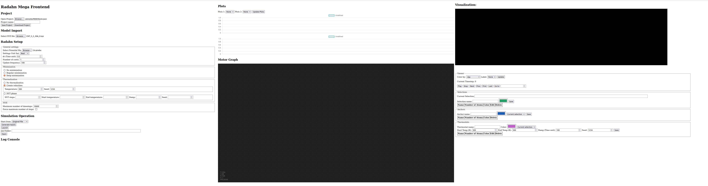
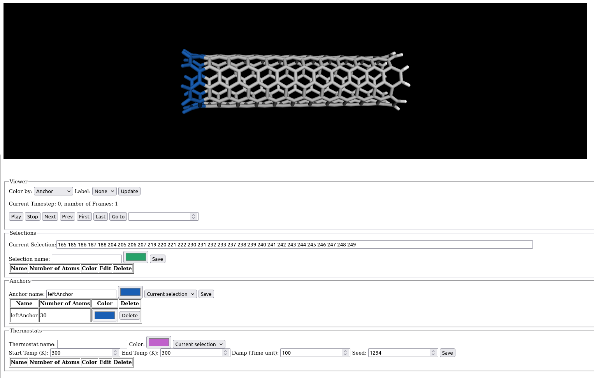
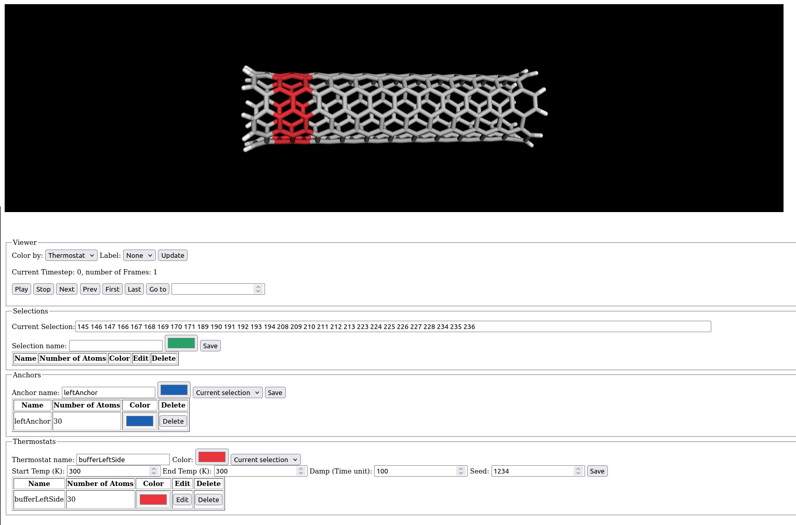
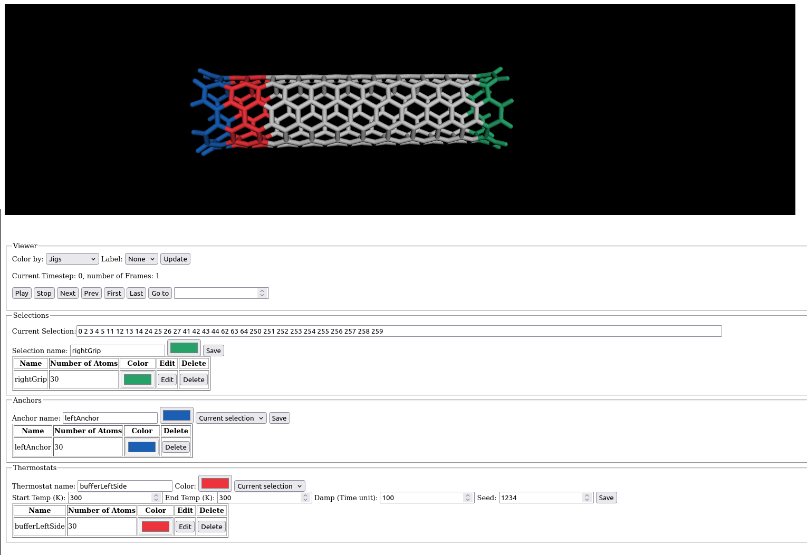
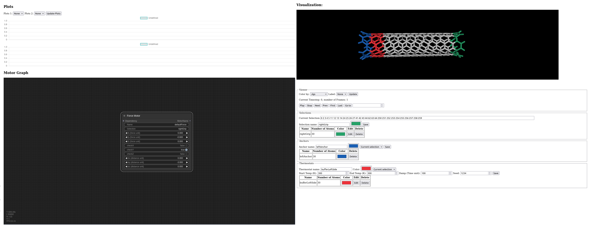
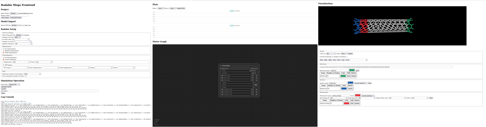
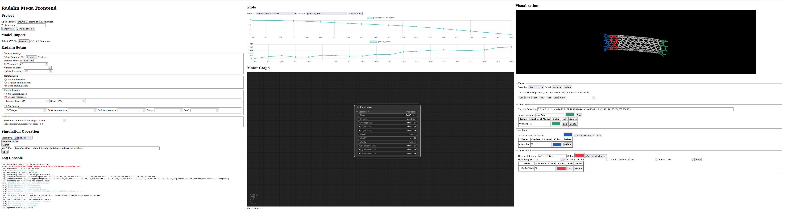

# Radahn

Radahn is interactive molecular dynamic application allowing users to steer their MD simulations and getting live feedback. The framework is build around LAMMPS and Gromacs as possible simulation backend. 

# Feature set

- Real time visualization and data extraction from a molecular dynamic simulation
- Set of motors to add user interactions in a molecular simulation
- Lammps as simulation backend currently, Gromacs will be added later on.
- Frontend in a web browser to load a molecular model, configure a set of motors to apply to the model, and visualize the simulation in real time
- Works on Linux, Windows via WSL

# Related project:

- [LAMMPS](https://docs.lammps.org/Manual.html)
- [Godrick](https://github.com/madreher/Godrick)
- [Conduit](https://llnl-conduit.readthedocs.io/en/latest/index.html)

# Installation

## Docker method

### Get the sources 

We first need to get the source code. Create a folder where you would like to get the sources, then do the following:

```
# Get the sources 
cd /path/to/source
git clone https://github.com/madreher/radahn.git .
```

### Install Docker on Ubuntu and WSL2 (first time install only)

This first set of instruction should be executed only the fist time this software gets installed. On Windows, these instructions should be executed within WSL.
```
# Install docker
sudo docker/ubuntu/install_docker_ubuntu.sh

# Add the current user to the docker group
sudo usermod -aG docker $USER

# **IMPORTANT: RESTART!!**

```

### Install Docker on OSX  (first time install only)

Download [Docker](https://docs.docker.com/desktop/install/mac-install/) for OSX here based on your processor. After installation, you will have to launch the desktop application at least once to finish the setup of docker. After this, the command `docker` should become available in the terminale. To test:
```
matthieu@Matthieus-MacBook-Air .radahn % docker --version
Docker version 27.0.3, build 7d4bcd8
```

### Prepare Folders and config files (first time install only)

Radahn relies on a user folder to store relevant configuration files and prepare where the simulation data will be stored. 

```
# Setup Radahn folders and variables
mkdir $HOME/.radahn
mkdir $HOME/.radahn/jobs
mkdir $HOME/.radahn/projects

# Copy the environment file to the radahn folder
cp docker/ubuntu/env_docker $HOME/.radahn

# Edit the first lines of the file env_docker where you copied it to match your system. Ex:
RADAHN_ROOT_JOB_FOLDER=/home/matthieu/.radahn/jobs
RADAHN_ROOT_PROJECT_FOLDER=/home/matthieu/.radahn/projects
```

### Create/Update Docker image

The following instructions should be executed every time the user wants to update its version of Radahn. For Windows, these instructions should be executed within WSL.

**IMPORTANT**: Radahn is currently in very early stages and doesn't provide a proper versioning yet. Versions will starts once a minimal set of features becomes available. However, users can choose to add version number or commit tag to their image name in the meantime if desired. Once versioning officially start, these instructions will be updated to properly reflect the image version.
```
cd /path to source
git pull 
cd docker/ubuntu
# Lammps full build
docker build --no-cache -t radahn-ubuntu:current .
# Lammps min build
docker build --no-cache -f ./Dockerfile_minlmp -t radahn-minlmp-ubuntu:current .
```

Once the docker images, Radahn is ready to be used! 
First start by launching the server:
```
# Run in user space with job folder mounted
# Lammps full build
docker container run --rm -it -p 8080:5000 -v $HOME/.radahn:$HOME/.radahn --workdir /app --user $(id -u):$(id -g) -e RADAHN_FRONTEND_ENV_PATH=$HOME/.radahn/env_docker radahn-ubuntu:current
#Lammps min build
docker container run --rm -it -p 8080:5000 -v $HOME/.radahn:$HOME/.radahn --workdir /app --user $(id -u):$(id -g) -e RADAHN_FRONTEND_ENV_PATH=$HOME/.radahn/env_docker radahn-minlmp-ubuntu:current

# In the container, you can start now start the webserver in two ways:

# Option 1: automatic
./launch_frontend.sh

# Option 2: manual
cd /app/radahn/radahn/build/install/frontend
source /app/radahn/radahn/build/install/docker/ubuntu/activate.sh
flask --app radahn_frontend run --host=0.0.0.0
```

Once the server is launched, open a browser, and go to the page http://localhost:8080/

These instructions have been tested on native Ubuntu 22.04, Windows 11 via WSL2 (Ubuntu 22.04.3)

## Manual compilation 

### Ubuntu 22

TODO

# How to use Radahn

## Goal

In this section, we are going to cover the main workflow provided by Radahn. A typical workflow is composed of 3 phases:
- Model preparation, which includes loading a molecular model and creating jigs (motors, anchors, thermostats)
- Simulation setup, which includes the selection of a forcefield, the configuration for the minimization, thermalization method, and actuation of the motors
- Running the simulation

In this example, we will import a single nanotube and try to bend one of it extremity while maintaining the other side in place.


## Phase 1: Model preparation

The first step is to install Radahn, launch the server, and open the frontend in your web browser.
To install Radahn, please follow the instructions in the Section [Installation](#installation).

To launch the server:
```
docker container run --rm -it -p 8080:5000 -v $HOME/.radahn:$HOME/.radahn --workdir /app --user $(id -u):$(id -g) -e RADAHN_FRONTEND_ENV_PATH=$HOME/.radahn/env_docker radahn-minlmp-ubuntu:current
./launch_frontend.sh
```

Then open a web browser, and go to the address: http://localhost:8080 .
This should open a page looking as follow:


We will first start by loading the molecular model of the nanotube. In the source, the model is available at `models/CNT_5_5_30A_X/CNT_5_5_30A_X.xyz` . You can load it by selecting the file in the 'Model Import' section on the left side of the page.

Once loaded, the molecular model should appear in the viewer as shown below.


We are now going to set up the jigs for the scenario. First, we need to create an anchor on the left side of the molecule. To do so, first select 2 layers of carbons on the left side by maintaining `left shit + left click` in the molecular viewer and draw a rectangle around these layers. You can rotate the camera by maintaining the left click, or translate the camera by maintaing the wheel button. When releasing the mouse click, the current selection will apear in yellow. You can then create an anchor by going to the `Anchors` section below the viewer, choose a name (alphanumerical only) and a color for the anchor, make sure that `Current selection` is selected for the selection, and click on `Save`. Your anchor should now appear in the table below. You can check in the viewer as well by selecting `Anchor` in the `Color by` menu just under the viewer and click on the `Update` button on the right. The viewer should now look something like this:


When using anchors, it is highly recommended to setup a buffer zone with a thermostat near the anchor to create a transition zone between the anchor and the rest of the model. To do so, we are going to select another zone next to the anchor of about 2-3 layers of carbon with the same selection method. Once you have your selection, go to the `Thermostats` section at the bottom, under the anchors. As previously, choose a name (alphanumerical only), a color, and make sure that `Current selection` is selected for the selection. In addition, we need to setup the temperature of the thermostat. For this case, we are going to run the simulation at 300K after warm up. In the thermostats setting, set `Start Temp` and `End Temp` to 300 (K), 100 for the `Damp` and a seed of your choosing (must be integer). Once this is done, you can click on the `Save` button. You can check your thermostat by selecting `Thermostat` in the `Color by` menu below the viewer and click on `Update`. The viewer should now look something like this:


Finally, we would like to apply a downward force to the right side of the nanotube. The first step is to create a `Selection` object. To do so, as previously, select about 1-2 layers of carbon on the right extremity of the nanotube, and go to the `Selections` menu below. Choose a name (alphanumerical only), a color, and click on `Save`. You selection should now appear in the table below. You can check your entire setup by selecting `Jigs` in the `Color by` menu below the viewer and click on `Update`. The viewer should now look something like this: 


Once the Selection object is created, it can be used by motors. Let's go to the middle part of the interface, in the `Motor Graph` Section. On the grid, do a right click, then `Add Node`->`motor`->`Force motor` and it will create a node in the grid. In this example, we want to apply a force on the negative Y. First, left click on the `Selection` field of the node, and type the name of the selection that you created previously and hit `Enter`. In the `fy` field, to a left click and enter a value of `-0.6` (don't forget the `-` or the nanotube will do upward instead of downward) and hit `Enter`. Check the field `CheckY` and make sure that it is set to `true`. This will tell the motor that it needs to check the Y axis to decide whether or not the motor has completed its task. Finally, in the `dy` field, left click and enter a value of `-3` (don't forget the `-`) and hit `Enter`. This will tell the motor that we would like the selection to go down by -3A, at which point the task of the motor will be completed and the motor will stop outpouting forces. 

After all this setup, the board should now look like this:


## Phase 2: Simulation pipeline setup


### General Settings

In this section, we are going to setup the simulation pipeline step by step. First, we are going to select a forcefield (or potential file). On the left side, in the `General settings` section, use the `Select potential file` button, and select a file. You can find several potential files in the folder `models/potential`. For this example, I would suggest the file `models/potentials/CH.airebo` . This forcefield will use the Airebo potential method. In the settings unit set below, select `real`, which correspond to the `real` unit style from [Lammps](https://docs.lammps.org/units.html). 

**IMPORTANT**: This setting is not correlated to the type of forcefield used. For example, the airebo potential is written for the `metal` unit style from Lammps, but the settings can be `real`. This is because Radahn will automatically convert the user settings to the appropriate units at runtime. This way, you can change the potential file without having to worry about changing your settings every time. 

To finish the general settings, set the `dt` to 0.5. 

### Minimization

The minimization settings are currently very simple. You can choose between no minimization (to use only if the imported model is already minimized with the potential file), a simple minimization (2 pass minimization with default settings), or a deep minimization (longer execution time, but ensure a better quality result). For this example, please select the `Deep minimization` option (the model is simple, it will just take a couple of seconds).

### Thermalization

The thermalization phase is intented to warm up the non anchored atoms. Radahn currently offers 3 options: `no thermalization`, `create velocities`, and `NVT phase`. No thermalization skips this phase. The `create velocities` option generate velocity vectors for a given temperature on all the non-anchored atoms. The `NVT phase` runs a NVE simulation for a given number of steps, where all the non anchored atoms are placed within a [Langevin thermostat](https://docs.lammps.org/fix_langevin.html) and warm up the atoms from the `start Temp` to a target `end Temp`. Note that the `end Temp` is not guaranteed to be reached! 

**IMPORTANT** During this phase, the thermostats declared previously are not active yet! However, the thermostats should typically be set to match the end temperature given to thermalization settings.

For this simple example, we are going to use the `create velocities` option and select 300 for the temperature.

### NVE

During this phase, the user thermostats and motors become active. This means that now only the atoms within a thermostat will be part of a langevin group and have their temperature controled. Additionally, the motors will start to inject commands into the running simulation. 

In this section, the user must select a `maximum number of timesteps`. This is the maximum duration of this phase. It is to ensure that the simulation doesn't run indefinitely if one or several motors cannot complete their tasks. The option `Force maximum number of steps` can be used to force the NVE phase to continue, even if all the motors have completed their tasks. In a normal simulation, the NVE phase will end if 1) the maximum number of timesteps is reached (not accounting for the NVT phase if enabled), or 2) all the motors have completed their tasks, whichever happens first. The option `Force maximum number of steps` removes the second termination criteria. 

For this example, set the number of timesteps to 10000 and leave the `Force maximum number of steps` unchecked. And with that, the simulation is ready to be launched! The board should look like this:


## Phase 3: Running the simulation

Once everything is setup, hit the `Launch` button in the `Simulation Operation` section. The field `Job Folder` will point to a folder right after, and start to output messages in the console below. After typically a couple a seconds (depending on your machine), the nanotube in the viewer will start to move, and as expect the right side of the nanotube is going downward. 

Additionally, you'll note that the `Plot 1` and `Plot 2` menu at the top of the middle section now have a list of fields available for plotting. For this example, let's select `defaultForce.distanceY` (adjust to the name you gave to the motor if you changed the default one) for the Plot 1, and `global.v_REBO` for Plot 2 and hit `Update Plots`. This will display the plots for these two quantities. The first plot indicate the difference on the Y axis between the starting position of the geometric center of the group associated with the motor, and its current geometric center. This helps to visualization the impact made by the motor. The second plot corresponds to the energy of the system calculated by airebo. 

Finally, the `Viewer` section on the right does provide basic functions to scroll through the trajectory. 

The final board should look something like this:


And this concludes this step by step tutorial on how to use Radahn!